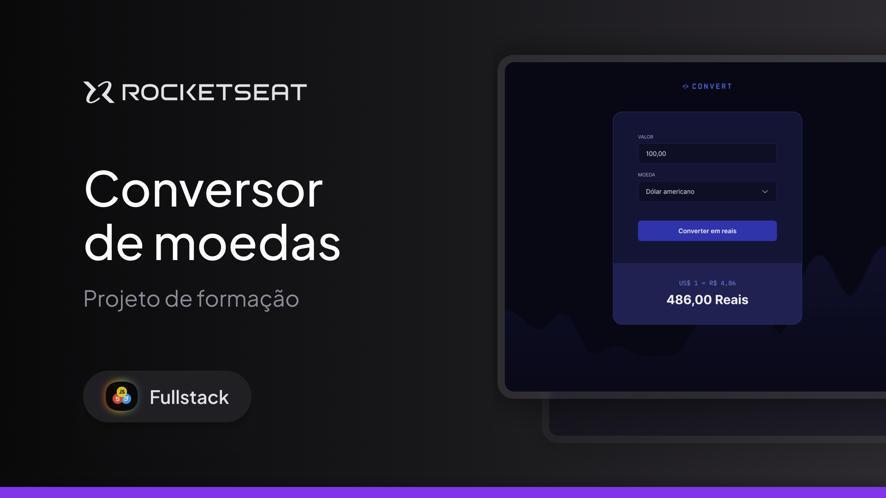

# Formação Full-Stack: Conversor de moedas

Acesse em: <a href="https://limacaiquelg.github.io/fullstack-convert/">https://limacaiquelg.github.io/fullstack-convert/</a>

 

Este projeto consiste em uma página web desenvolvida utilizando HTML, CSS e Javascript. A aplicação é um conversor online de moedas, onde é possível converter qualquer valor inteiro positivo em dólares americanos, euros ou libras esterlinas para reais brasileiros.
 

Como este projeto faz parte do módulo de Javascript Básico da formação Full-Stack da Rocketseat, a estrutura e estilização da página foram criadas a partir do template disponível em <a href="https://github.com/rocketseat-education/convert-template/">https://github.com/rocketseat-education/convert-template/</a>. Os seguintes tópicos são trabalhados nesta aplicação: 

<ul>
  <li>Manipulação do DOM</li>
  <li>Manipulação de strings em Javascript</li>
  <li>Funções em Javascript</li>
  <li>Eventos em Javascript</li>
  <li>Expressões regulares</li>
</ul>

Conforme citado anteriormente, este projeto foi desenvolvido durante a formação Full-Stack da Rocketseat, sob a orientação do professor <a href="https://github.com/orodrigogo/">Rodrigo Gonçalves</a>. Como forma de aprendizado, os valores fixos para as cotações foram substituídos pelos valores reais das cotações disponibilizados pela API "Olinda - Plataforma Ágil de Serviço de Dados" do Banco Central do Brasil (mais informações disponíveis em <a href="https://dadosabertos.bcb.gov.br/dataset/taxas-de-cambio-todos-os-boletins-diarios/">https://dadosabertos.bcb.gov.br/dataset/taxas-de-cambio-todos-os-boletins-diarios/</a>). Os seguintes tópicos foram trabalhados nesta <i>feature</i>:

<ul>
  <li>Consumo de APIs com Javascript</li>
  <li>Manipulação de datas em Javascript</li>
  <li>Objetos em Javascript</li>
  <li>Documentação com JSDoc</li>
</ul>